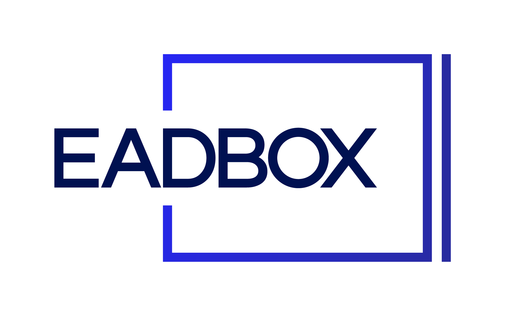
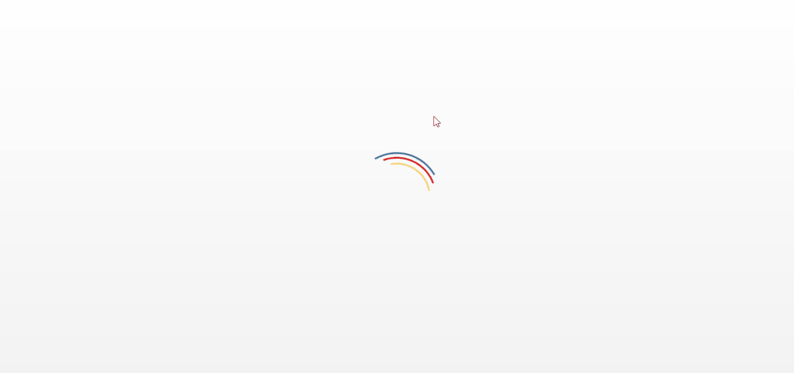

# EADBOX Course

EADBOX Course é um projeto de landing-page de cursos desenvolvido como desafio para o processo seletivo da EADBOX

> **Proposta**
> Implementar uma listagem com os cursos cadastrados na plataforma consumindo a API Eadbox utilizando Angular 2+.

## Desenvolvimento

### Ambiente

O aplicativo pode ser acessado através do GitHub Pages, [clicando aqui](https://lhcgoncalves.github.io/eadbox-course).

### Back-end

O EADBOX Course consome a API oficial da EADBOX para o usuário definido no arquivo `src/environments/environment.ts` em localhost ou `src/environments/environment.prod.ts` em produção.

Em desenvolvimento, é possível utilizar o `json-server`, rodando o comando `npm run json-server`, que consome o arquivo `db.json`

### Front-end

O sistema utiliza o Angular 2 como framework front-end e Bulma como framework CSS. O build faz uso do Webpack para limpeza e minificação na branch `gh-pages`.

## Como instalar localmente

Primeiro, clone o repositório e acesse a pasta raíz do projeto.

Depois, instale as dependências através do NPM:

    npm install

Inicie o servidor built-in através do comando:

    npm start run

- Como a API possui proteção de CORS, é necessário o uso de um Proxy (`angular-proxy) para prover o acesso a API de forma segura
